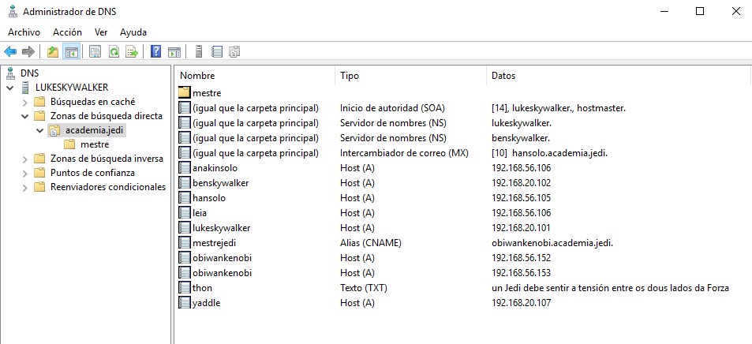
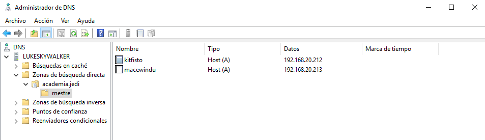
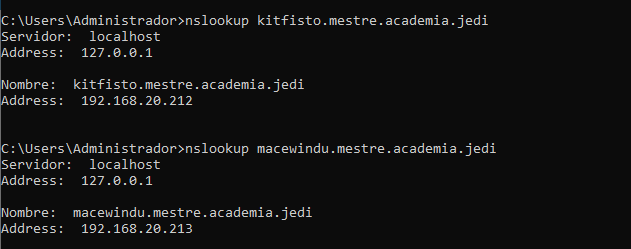
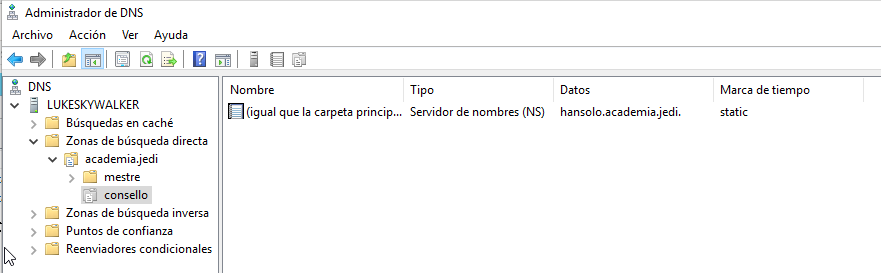
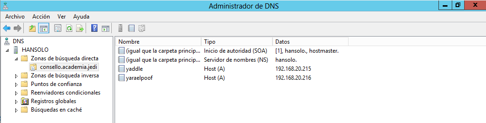
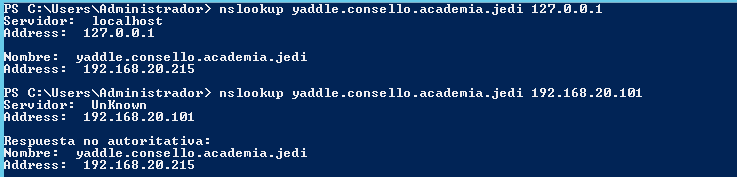
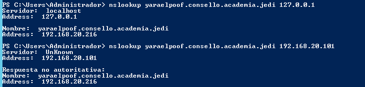

# 1.5 Subdominios

- Instala no equipo lukeskywalker un subdominio chamado "mestre", e dentro del os rexistros 
    - A, kitfisto 192.168.20.212
    - A, macewindu 192.168.20.213
    - Captura a zonas, e un cliente resolvendo un rexistro A do dominio e do subdominio contra lukeskywalker

    -academia.jedi en lukeskywalker:

    

    -subdominio mestre:

    

    -Comprobacions desde benskywalker:

    

- Instala no equipo hansolo (Windows 2012) un subdominio delegado de "academia.jedi" chamado consello. . Engade nel os rexistros:
    - A, yaddle 192.168.20.215
    - A, yaraelpoof 192.168.20.216
    - Captura as dúas zonas, e un cliente resolvendo un rexistro  A do dominio e do subdominio contra hansolo e lukeskywalker

    -Creamos o subdominio delegado en lukeskywalker:

    

    -Creamos a zona en hansolo e añadimos os rexistros:

    -Hansolo:

    

    -Comprobamos:

    -yaddle:

    

    -yaraelpoof:

    

- Instala no equipo darthvader un subdominio chamado antigarepublica, e nel os rexistros:
    - A, xendor 192.168.20.222
    - A, ardenlyn 192.168.20.223.
    - Captura as dúas zonas, e un cliente resolvendo un rexistro  A do dominio e do subdominio contra darthvader

    -Zona directa (db.starwars.lan):

    

    -Zona inversa (db.20.168.192):

    

    -Comprobamos:
    

- Instala no equipo leia (Debian/Ubuntu Server) un subdominio delegado de "starwars.lan" chamado imperio. Engade nel os rexistros:
    - A, tsuichoi 192.168.20.225
    - A, bultarswan 192.168.20.226.
    - Captura as dúas zonas, e un cliente resolvendo un rexistro  A do dominio e do subdominio contra leia e darthvader

    -Subdominio delegado en leia (db.imperio.starwars.lan):
    

    -named.conf.local en leia:
    

    -Zona primaria (db.starwars.lan):
    

    -Comprobamos:
    